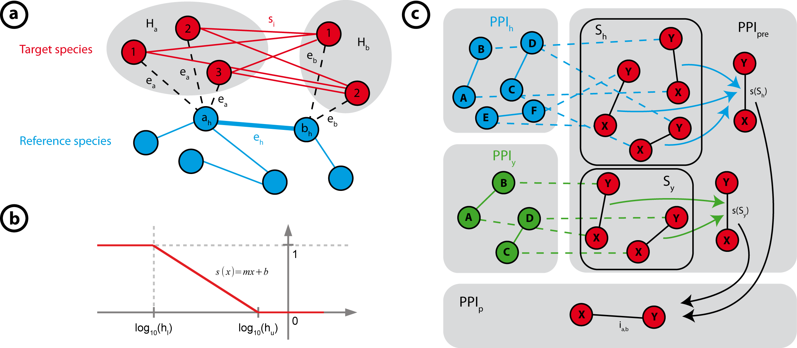

```{r style-knitr, eval=TRUE, echo = FALSE, results = 'asis', warning=FALSE}
suppressPackageStartupMessages({
    library("Path2PPI")
})
BiocStyle::markdown()
```

# Introduction
Prediction of protein-protein interaction (PPI) networks is an important 
approach to gain knowledge about protein interactions in model organisms 
where only a small number of PPI information is available. 
Current PPI databases, providing predicted interaction data, lack many 
organisms or contain less reproducible information about the predicted 
interactions. Currently available prediction approaches are mainly based on 
biological data (functional annotation, co-expression etc.) which often are 
not available for many "less established" organisms, for example, where only 
sequence data is available. In addition, it is of major interest to get 
knowledge about a certain pathway in such a "less-studied" 
organism. To overcome these drawbacks **Path2PPI** can be used to predict 
proteins and interactions of a certain pathway of interest in a target  
organism by using and combining the PPIs of other well established model 
organisms.

To do so, it needs a list of proteins of interest from each reference species 
and the result files produced by the local NCBI BLAST (Camacho et al., 2009) 
tool (see next chapter). The relevant interactions based on the 
users' protein lists are automatically extracted from the corresponding 
_iRefIndex_ files (Razick et al., 2008).

# Preparation of the data
In this tutorial, we make use of the test data set provided with the package. 
This data set consists of all data files necessary to predict the interactions 
of the induction step of autophagy in _Podospora anserina_ by 
means of the corresponding PPIs in human and yeast. Hence, we first load the 
"autophagy induction" test data set:

```{r}
data(ai) #Load test data set
ls() #"ai" contains six data objects
```

As stated by `ls()` the test data set contains six data objects 
(three for each of the two reference species human and yeast).
First, the algorithm requires a list of proteins which define the 
corresponding pathway for each reference species, 
defined in *"human.ai.proteins"* and *"yeast.ai.proteins"* (see section 2.1). 
Second, the algorithm requires the data frames which contain the interactions 
of each reference species defined in *"human.ai.irefindex"* and 
*"yeast.ai.irefindex"* (described in more detail in section 2.1).
Third, the algorithm needs to know the homologous relations between the target
species with each reference species. These relations are defined in the 
data frames *"pa2human.ai.homologs"* and *"pa2yeast.ai.homologs"* 
(we describe this in more detail in section 2.2).

If you want to use **Path2PPI** for your own demands, you have to 
generate and prepare the necessary data files.

## Proteins and interactions of pathways of interest

We list the proteins which are associated with a specific pathway of interest 
in a character vector for each reference species. To give you an 
example for such lists, we take a brief look into the loaded data set. 
Among others, we found the two named character vectors *"human.ai.proteins"* 
and *"yeast.ai.proteins"* which consist of the corresponding proteins for yeast 
and human, our two reference species:

```{r}
human.ai.proteins
yeast.ai.proteins
```

In this example, the values are the trivial names of the proteins and the 
names are the actual protein identifiers. **Path2PPI** also accepts simple 
character vectors where the values are the protein identifiers, if the trivial 
names of the proteins are not available. For example, this simple character 
vector, only consisting of the protein identifiers, would be also a valid 
protein list:

```{r, echo=FALSE}
names(human.ai.proteins)
```

The major advantage of using a named character vector with the trivial names,
is that these names will be shown in the plots allowing for a more comfortable 
interpretation.
You can use various accession formats for the protein identifiers which are 
supported by _iRefIndex_ (e.g. UniProt, SwissProt, Ensembl). However, we 
urgently recommend to use UniProt identifiers, since those are the most 
established ones.

Use the default R functions to load your own protein lists of interest into R 
(e.g. `read.table`).

These proteins of interest are applied to find relevant interactions in the 
corresponding species _iRefIndex_ file. _iRefIndex_ tables are available for 
the seven most established model organisms and can be found here: 
http://irefindex.org/wiki/index.php?title=iRefIndex.
You can also use the corresponding _iRefR_-package to directly archive 
the _iRefIndex_ data frames from this page. Unfortunately, the package is not 
updated as frequently as the web page and it may be that you do not get the 
latest release of a corresponding file.

In the "autophagy induction" test data set, only a very small part of the 
_iRefIndex_ files for yeast and human are provided which contain the relevant 
interactions necessary for this tutorial. The complete files are much larger. 
The data frames *"human.ai.irefindex"* and *"yeast.ai.irefindex"* in the 
test data set contain these corresponding _iRefIndex_ parts. See:

```{r, eval=FALSE}
str(human.ai.irefindex)
str(yeast.ai.irefindex)
```


## Get homology files using NCBI BLAST+

You also need the result files produced by the BLAST+ toolkit provided by the 
NCBI web page: 
http://blast.ncbi.nlm.nih.gov/Blast.cgi?PAGE_TYPE=BlastDocs&DOC_TYPE=Download. 
The test data set already includes the necessary results of 
the BLAST searches of the proteoms of _P. anserina_ against the proteoms of 
yeast and human (*"pa2human.ai.homologs"* and *"pa2yeast.ai.homologs"*):

```{r}
head(pa2yeast.ai.homologs)
head(pa2human.ai.homologs)
```

The second column (V2) contains the protein identifiers of the corresponding 
reference species to which the protein of the target species 
(here: _P. anserina_) in the first column (V1) is homologous. Keep in mind 
that these protein identifiers are equal to those we used in the protein lists 
described above. 

If you are unfamiliar with this toolkit, we refer to the BLAST+ user manual or 
to the broadly available tutorials in the web. 

Nevertheless, we want to give you a very short description on how to use this 
toolkit. We assume that you already have loaded and installed the NCBI BLAST+ 
toolkit and you also have each proteome file in FASTA format of each species 
(target and reference species). You first have to create the databases for 
each reference species, here, for human and yeast:

```
makeblastdb -in human.fa -input_type fasta -dbtype prot -out human_proteins 
-title human_proteins
makeblastdb -in yeast.fa -input_type fasta -dbtype prot -out yeast_proteins 
-title yeast_proteins
```
Subsequently, you can start the comprehensive BLAST searches using the FASTA 
file of your target species (here: _P. anserina_):

```
blastp -query panserina.fa -db human_proteins -out human_panserina.out -evalue 
0.0001 -outfmt 6
blastp -query panserina.fa -db yeast_proteins -out yeast_panserina.out -evalue 
0.0001 -outfmt 6
```
Please, make sure that you use as the output format the tab delimited list 
indicated by the parameter `-outfmt 6`. The two species-specific homology 
files which are now generated, can be imported into your R session, using the 
function `read.table`, and subsequently used as data frames for the 
**Path2PPI**-package.

# Predict PPI in target species
After the necessary data sets are generated or loaded, respectively, we can 
start with the prediction.

## The Path2PPI object
An object of the class _Path2PPI_ represents the major instance which is 
responsible for storing and managing of each data set and for each computation 
and prediction step. Hence, we first have to create a new instance of the 
class _Path2PPI_ with the corresponding information:

```{r}
ppi <- Path2PPI("Autophagy induction", "Podospora anserina", "5145")
```
The arguments are the title of the pathway we want to 
predict, the taxonomy name of the target species ("Podospora anserina") and 
its corresponding taxonomy id ("5145").

## Add reference species
This new instance does not contain any reference species or a predicted PPI, 
yet:

```{r}
ppi
```

To add the reference species, for which we have collected the 
necessary data, we make use of the method `addReference`.

```{r}
ppi <- addReference(ppi, "Homo sapiens", "9606", human.ai.proteins, 
                    human.ai.irefindex, pa2human.ai.homologs)
```
Besides the taxonomy name and the taxonomy identifier, this method requires 
the list, containing the proteins of the pathway of interest, the 
corresponding _iRefIndex_-data frame or the file name of the corresponding 
_iRefIndex_ file, and the species specific homology data set generated by the 
NCBI BLAST+ toolkit. This method searches for all relevant interactions in 
the _iRefIndex_ data frame.
There are different and often ambiguous protein identifiers defined in an 
_iRefIndex_ file and the "major" identifiers are not necessarily 
those defined in the corresponding "major" columns "uidA" and "uidB". 
Furthermore, _iRefIndex_ also contains complexes. Hence, this method applies 
an advanced search algorithm to find automatically relevant interactions 
associated with the pathway or the proteins of interest, respectively. You do 
not have to predefine the identifiers' types (UniProt, Swissprot, Ensembl 
etc.), since these types are often assigned ambiguously. The algorithm 
searches for each identifier in 10 columns where any type of identifier or 
accession number is defined, for example, "uidA", "altA", "OriginalReferenceA", 
"FinalReferenceA", "aliasA", "uidB", "altB", "OriginalReferenceB", 
"FinalReferenceB" and "aliasB". Additionally, it searches for each complex to 
which one or more of the predefined proteins are associated. Subsequently, 
each homologous relationship which is not relevant for the previously found 
interactions is declined.

In the same manner we add yeast to our Path2PPI-instance:
```{r}
ppi <- addReference(ppi, "Saccharomyces cerevisiae (S288c)", "559292", 
                    yeast.ai.proteins, yeast.ai.irefindex, 
                    pa2yeast.ai.homologs) 
```

In this tutorial, we want to predict the PPIs in 
\textit{P. anserina} based on these two reference species. You can use other 
and/or more reference species for your demands.

Now, we can get all processed information about the added reference species 
using the method \textit{showReferences}:

```{r}
showReferences(ppi)
```
If we want to know which interactions have been found or which interactions 
are associated with the proteins of interest in a specific reference species 
(e.g. human), we can use the method as follows:
```{r}
interactions <- showReferences(ppi, species="9606", 
                               returnValue="interactions")
head(interactions)
```
For more information about the method we refer to the corresponding manual 
page (`?showReferences`).

## Predict PPI
After we added all reference species and all necessary data, we can start with 
the prediction. To predict the PPI network in the target species we 
use the method `predictPPI`:

```{r}
ppi <- predictPPI(ppi,h.range=c(1e-60,1e-20))
```

This method uses different arguments to influence the prediction 
approach and to define the output of the PPI network. For a detailed 
description of the various arguments we refer to the corresponding manual 
(`?predictPPI`). Here, we only use the argument `h.range` where the first 
value corresponds to the lower bound and the second value to the upper bound 
of the homology range. That means that each E-value which is equal or less 
the lower bound will be scored with 1, and each E-value which is equal or 
larger than the upper bound will be scored with 0 (see appendix for a 
detailed description).

According to the reports generated by this method two species specific PPI 
networks led to a PPI network in the target species with 13 
interactions. To achieve further information about the former prediction
step, we just type:

```{r}
ppi #show(ppi)
```

# Results of the prediction

After we predicted the PPI network of the 
"autophagy induction" pathway in _P. anserina_ we now want to know how this 
network looks like. And we want to know which proteins and interactions 
actually are associated with this pathway in our target species.

## Plotting the results

To get a graphical representation of the predicted PPI network, *Path2PPI* 
provides three different plotting types. First, to get only the 
predicted PPI, we use the plot function of the Path2PPI-object, which is 
based on the _igraph_ plotting function (Csardi and Nepusz, 2006):
```{r}
set.seed(12) #Set random seed
coordinates <- plot(ppi, return.coordinates=TRUE)
```
There are various arguments provided with this method (see `?plot.Path2PPI`). 
Here, we initially use the `return.coordinates` argument since we want to 
save the coordinates of the vertices for the next plotting approach.  
  
In the second approach, we want to know from which reference 
species the different predicted interactions originated. We assign the 
previously computed coordinates to the plotting function since we want to 
compare both networks:
```{r}
plot(ppi,multiple.edges=TRUE,vertices.coordinates=coordinates)
```
The different colors of the edges correspond to the species, see the taxonomy 
identifiers in the legend: 5154 for _P. anserina_, 9606 for human, and 559292 
for yeast) from which the interaction was deduced. 
For example, we can see that the edge between the proteins "B2AWL" and 
"B2AE79" in the upper network is thicker than the others. This indicates 
that the interaction was found in more than one reference species. In the 
second plot, we see that this interaction is based on six interactions found 
in yeast and two interactions found in human.  
  
Next, we want to plot the so-called _hybrid_ PPI network, where 
we additionally can see the underlying reference interactions or the 
underlying reference PPI networks, respectively, and each homologous 
relationship. We also want to set the vertex labels, since we know the 
trivial names of the target species proteins. You can set the label for each 
protein of each species. Additionally, we want to change the species colors:
```{r}
set.seed(40)
target.labels<-c("B2AE79"="PaTOR","B2AXK6"="PaATG1", 
                 "B2AUW3"="PaATG17","B2AM44"="PaATG11",
                 "B2AQV0"="PaATG13","B2B5M3"="PaVAC8")
species.colors <- c("5145"="red","9606"="blue","559292"="green")
plot(ppi,type="hybrid",species.colors=species.colors,
     protein.labels=target.labels)
```
The dotted edges correspond to an homologous 
relationship between a protein of the target species and a reference species. 
Only those proteins and interactions of the reference species are shown which 
actually led to an interaction in the target species.


## Get detailed information about each interaction
After we know how the predicted PPI network of this pathway may look 
like in the target species we want to know more about the predicted 
interactions. For this purpose we make use of the method `showInteraction` 
which requires the protein identifiers of the interaction:
```{r}
showInteraction(ppi,interaction=c("B2AT71","B2AE79"))
```
For further details about the underlying reference interactions we can 
use the additional argument `mode`:
```{r}
showInteraction(ppi,interaction=c("B2AT71","B2AE79"),mode="detailed",
                verbose=FALSE)
```
This data frame contains each single predicted interaction of the current 
interaction and all corresponding reference interactions. For the interaction 
of the proteins in columns one and two, the third column gives the prediction 
score.
The fourth and the fifth columns show the homology score of 
the source protein (A) or the target protein (B), respectively, in the target 
species to its equivalent (column seven and eight) in the reference species 
(column six). The column "pos.edges" (possible edges) indicates how many 
interactions could be derived from this interaction in the reference 
species, in contrast, to the number of interactions in "used.edges" which 
actually were adopted. The last column gives the identifier of this 
interaction in the _iRefIndex_ data set.

To get the corresponding _iRefIndex_ entries for these reference 
interactions we can use this method as follows:
```{r}
ref.interaction <- showInteraction(ppi,interaction=c("B2AT71","B2AE79"),
                                   mode="references.detailed",verbose=FALSE)
```
The data frame now stored in the variable `ref.interaction` is part of 
the _iRefIndex_ table which contains all information about the current 
reference interactions. We can use this data frame with default R 
functionality to search for specific information of the reference 
interactions. For example, if we want to know from which study (author and 
publication) and from which database the interaction of the proteins "P42345" 
and "P42345" with the interaction identifier "742389" (first row) was adopted, 
we use:

```{r}
ref.interaction[ref.interaction$irigid=="742389",
                c("author","pmids","sourcedb")]
```
In this manner you are able to search for each entry provided by the 
_iRefIndex_ table.


## Export results

Now, we want to work with the predicted PPI network and do further analyses 
either directly in R or using an advanced network analysis tool like Cytoscape 
(Cline et al., 2007). To do so, we can use the method `getPPI`, which gives us 
the edge list of the PPI network:
```{r}
my.ppi <- getPPI(ppi)
my.ppi
```
If you want this PPI network with each single (not the combined one) predicted 
interaction, use the additional argument `raw=TRUE`.

We also want the edge list of the hybrid network which includes the PPIs of 
the reference species. For this purpose we use the method 
`getHybridNetwork`:

```{r}
my.hybrid <- getHybridNetwork(ppi)
my.hybrid
```
If you want to work with an _igraph_ object instead, use the additional 
argument `igraph=TRUE` in both methods. To export the edge lists, use default 
R functions like `write.table`. 


# References

Camacho, C. et al. (2009). BLAST+: architecture and applications. BMC 
Bioinformatics, 10(1), 421.  

Cline, M. S. et al. (2007). Integration of biological networks and gene 
expression data using Cytoscape. Nature Protocols, 2(10), 2366-2382.

Csardi, G. and Nepusz, T. (2006). The igraph software package for complex 
network research. InterJournal Complex Systems, 1695(5), 1-9

Razick, S. et al. (2008). iRefIndex: a consolidated protein interaction 
database with provenance. BMC Bioinformatics, 9(1), 405.

Kanehisa, M. et al. (2014). Data, information, knowledge and principle: back to
metabolism in KEGG. Nucleic Acids Research, 42(D1), D199-D205.


# Session info

```{r sessionInfo, print=TRUE, eval=TRUE}
sessionInfo()
```

# Appendix


## Biological evidence of the predicted PPI network

The example of autophagy induction was choosen, since it is well known and 
described for many eukaryotic organisms, including yeast, human and even 
_P. anserina_. Representatively and briefly described for yeast, the 
induction step works as follows:

Generally, nutrient availability activates the TOR-kinase, which phosphorylates
ATG13. Hyper-phosphorylated ATG13 cannot interact with ATG1 and ATG17 to build 
the ATG1 complex (including ATG11 and VAC8) , which is important for 
autophagosome nucleation. Hence, autophagy is inhibited. In contrast, under 
nutrient-depleted conditions, TOR is deactivated, ATG13 is dephosphorylated and 
available for complex formation with ATG1 and ATG17. The next step of the 
autophagy process - autophagosome nucleation - can begin.

As reference proteins we used those provided by the KEGG database 
(Kanehisa et al., 2014) for yeast (seven) and human (five). We compared 
the predicted PPI with that provided by the KEGG database for _P. anserina_.

We found that two of the five proteins of human, ULK1 and TOR, and all of the 
seven proteins of yeast have been taken into account from the algorithm.
This is due to the closer evolutionary distance of the both fungi and the
corresponding proteins.
The alogrithm predicts all of the proteins and interactions provided by the 
KEGG database for the induction step of autophagy in _P. anserina_.
Additionally, it also includes two additional proteins, which are not 
characterized yet. This is propably due to the fact that these two proteins
are putative serine/threonine kinases with similar motifs and sequences like
the TOR kinase.

Summarizing, this example shows that **Path2PPI** is able to transfer 
interaction data amongst organisms. The resulting PPI networks can serve as
starting points for further analyses and PPI studies.


## The prediction algorithm

**Aim:**
We aim to predict an interaction network in a target organism based on the 
interaction networks of well established model organisms. The networks are 
based on a predefined set of proteins which may belong to a certain pathway.
We consider the degree of homologies and the number of reference 
species.

**Requirements:**
The major initial requirements for the algorithm are the PPIs for each 
reference species, the BLAST results of the target species (_P. anserina_) 
against each reference species, and an E-value range defined by the upper 
bound $h_u$ and the lower bound $h_l$. The range is required to map the BLAST 
E-value interval $[h_l ,h_u]$ to a homology score in the interval $[1,0]$ 
where 0 is the worst and 1 the best value. 
We will exemplarily describe the algorithm based on the two reference 
species, human and yeast.

### Computing preliminary reference species-specific PPIs ###


**Figure 1. Steps of the prediction algorithm** a) It searches for 
each interaction (blue edges) in each reference species (blue) the 
corresponding homologs (dotted edges) in the target species (red). Each valid 
homologous protein from the first set, $H_a$, will now be connected with each 
homologous protein from the other set, $H_b$. The deduced interactions are 
scored, using the function described below. b) The linear function to map the 
BLAST E-values to the interval $[0,1]$. c) Combining the redundantly predicted 
interactions to one final PPI network, $PPI_p$, of the target species.  
  
At the beginning, we have the (undirected) PPI graphs of human 
$PPI_h=(V_h,E_h)$ and yeast $PPI_y=(V_y,E_y)$ (figure 1a, the blue graph 
corresponds to one reference species), a set of unassigned nodes $V_p$ which 
represents all _P. anserina_ proteins (figure 1a, red nodes) and an empty 
preliminary PPI graph of _P. anserina_ $PPI_{pre}=(V_p,E_p )=\emptyset$. 
The homology comparing approach leads to a directed homology graph

$H=(V_H,E_H)$ where

$V_H \subseteq (V_h \cup V_y \cup V_p)$ and

$E_H \subseteq \{ (a,b) \mid a \in V_p,b \in (V_y \cup V_h) \}$.

Each edge in $H$ is weighted by the E-values ($EV$) of the BLAST search. 

Before starting the algorithm we have to set three major parameters. First, the 
parameter $e_{thresh}$, which defines a threshold for the E-values. 
Homologous relations which exceed that theshold are immeditely declined and 
will not be taken into account anymore. The second and third parameters are 
the upper and the lower bound for an E-value range $[h_l,h_u]$, where 
$h_l < h_u \le e_{thresh}$ which will be 
mapped to the interval $[1,0]$ by the scoring function $s$ where $1$ is the 
best score and $0$ the worst (figure 1b). Since generally, homology-based 
network inference has to consider that more homologous proteins 
exist, we aim to distinguish and weight these relations by 
different scores provided by the scoring function. If only one homologous 
relationship exists, the scoring function will lead to the best score of 1, 
as well. This exception is due to the unambigous and desired situation if only 
one protein in the target species is homologous to the corresponding protein in 
the reference species. 

Each interaction of each reference species is handled one by one and 
contributes to the prediction and scoring with an equal weight of $1$, i.e. 
we do not distinguish between the underlying experimental methods. 
Furthermore, it is assumed that interactions and the reference species are 
stochastically independent, i.e. the occurance of one interaction does not 
influence the probality of the occurence of another interaction.
We start with the first reference species, here, $PPI_h$:

For each $e_h= \{ a_h,b_h \} \in E_h$ (figure 1a, vertices $a_h$ and $b_h$):

1. Get $H_a \subseteq H$ with each 
$e_a = \{ (a_{ea},b_{ea} ) \mid a_{ea},b_{ea} \in V_H , b_{ea}=a_h \}$ and 
$H_b \subseteq H$ with each 
$e_b= \{ (a_{eb},b_{eb}) \mid a_{eb},b_{eb} \in V,b_{eb}=b_h \}$ 
(figure 1a, dotted edges pointing to set $H_a$ or set $H_b$)

2. _Predefinition: Given the graph $H$ and $V(H)$ gives the set of vertices 
in $H$ and $E(H)$ the set of edges in $H$ then $\mid(V(H)\mid$ gives the number 
of vertices in $H$ and $\mid(E(H)\mid$ the number of edges in $H$._

    If $V(H_a)=\emptyset$ or $V(H_b)=\emptyset$, decline $e_h$, otherwise 
compute the homology score $s_h \to [0,1]$ for each edge $e_a \in H_a$ and 
each edge $e_b \in H_b$ based on the single E-values and the cardinalities
of $H_a$ and $H_b$:  
  
    If $\mid(E(H_a)\mid =1$ then $s_h(e_a)=1$ else 
$s_h(e_a) = \mid m log_{10}({EV}(e_a))+b \mid$,
  
    if $\mid(E(H_b)\mid =1$ then $s_h(e_b)=1$ else 
$s_h(e_b) = \mid m log_{10}({EV}(e_b))+b \mid$  
  
    with $m=\frac{1}{log_{10}(h_l)-log_{10}(h_u)}$ and $b=-(m log_{10}(h_u))$ 
(figure 1b).

3. Decline edges which are now scored with $0$, i.e. set 
    $H_a = H_a \setminus \{(e_a \in H_a),s_h(e_a)=0\}$ and  
  
    $H_b = H_b \setminus \{(e_b \in H_b),s_h(e_b)=0\}$.

4. Add each remaining vertex $\{v \in V(\{H_a \cup H_b\}) \wedge v \in V_p\}$ 
from target species to ${PPI}_{pre}$ and connect each node deduced from set 
$H_a$ with each node deduced from set $H_b$ (figure 1a, red edges). 
Compute a score $s_i$ for each of these new predicted edges (interactions) 
using the arithmetic mean:  
  
    $s_i=\frac{s_h(e_a)+s_h(e_b)}{2}$.  

Decline edges where $s_i \le s_{thresh}$ with $s_{thresh}$ as a predefined 
threshold.

Repeat step 1-4 with ${PPI}_y$ and each other reference species.

### Combining PPIs deduced from each reference species ###

Now, the algorithm has to combine all predicted and probably redundant 
interactions in ${PPI}_{pre}$ to one combined PPI of _P. anserina_, 
${PPI}_p = (V_p,E_p)$. In particular, it has to consider interactions which 
were suggested by both reference species PPI networks (figure 1c):

For each $e_i= \{ a_{ei},b_{ei} \} \in E({PPI}_{pre})$:

1. Get $I_{a,b} \subseteq {PPI}_{pre}$ with each 
$e_j = \{a_{ej},b_{ej} \mid a_{ej},b_{ej} \in E({PPI}_{pre}),((a_{ej}=a_{ei}) 
\wedge (b_{ej}=b_{ei})) \vee ((a_{ej} = b_{ei}) \wedge (b_{ej} = a_{ei})) \}$, 
i.e. further interactions with the same interacting partners of $e_i$ 
(each edge X-Y in figure 1c).

2. Divide  $I_{a,b}$ into subsets $S_h \in I_{a,b}$ and $S_y \in I_{a,b}$, 
depending on the reference species where the corresponding interactions have 
been found (black bordered areas in figure 1c).

3. Combine each score $s_i(s_h \in S_h)$ to one intra species score $s(S_h)$ 
and each score $s_i(s_y \in S_y)$ to one intra species score $s(S_y)$. Since a 
higher number of interactions increases the probability that $I_{a,b}$ exists 
in the target species, and the predicted interaction should be rated at least 
with the highest score, we sum up each score of each interaction in $S_h$ 
or $S_y$, respectively, using a recursive function where $s_k$ is the $k$th 
score in $s_i(s_y \in S_y)$. Additionally, $s_i(s_y \in S_y)$ has been sorted 
in a decreasing order:  
  
    $s(s_k)=s_k$ if $k=1$,  
  
    $f(s_k)=f(s_{k-1})+(1-f(s_k-1))*s_k$ otherwise.  
  
Hence, the intra species score is at least as high as the biggest sub score. 
For example, if we have three interactions deduced from one reference species, 
predicting all the same interaction in the target species with the scores 
$0.7$, $0.9$ and $0.6$. Then, the final species score is:  
$s(0.6,0.7,0.9)=0.9+(1-0.9)*0.7+(1-(0.9+(1-0.9)*0.7))*0.6=0.988.$

4. Combine the two intra species scores to one common inter-species or 
final-score $i_{a,b}$ (figure 1c lower area):  
$i_{a,b}=\frac{s(S_h)+s(S_y)}{m}+m-1$, where $m$ is the number of reference 
species for which the interaction $I_{a,b} \subseteq {PPI}_{pre}$ was found 
(i.e. $m=1$, if only in yeast or human and $m=2$, if in both).

5. Finally, add the new edge (interaction) $I_{a,b}$ to ${PPI}_p$ with the 
score $i_{a,b}$.